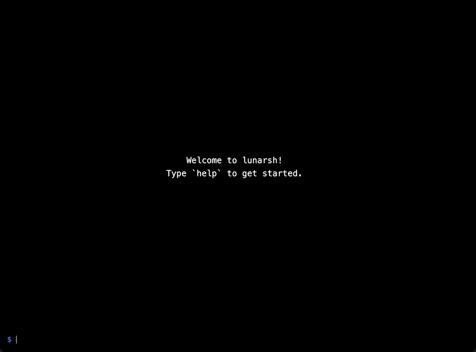

# LunarShell

LunarShell is a command-line interface written in Elixir.



## Installation

Add `lunarsh` to your list of dependencies in `mix.exs`:

```elixir
def deps do
  [
    {:lunarsh, git: "https://github.com/invadervimdev/lunarsh.git"}
  ]
end
```

Export the tailwind contents of this library in `assets/tailwind.config.js`:

```
...

module.exports = {
  content: [
    "./js/**/*.js",
    "../lib/my_app_web.ex",
    "../lib/my_app_web/**/*.*ex",
    "../deps/lunarsh/**/*.*ex",
  ],
  theme: {
...
```

If you're making your own commands, make sure LunarShell can find them by
adding this config option in `config/config.exs`:

```
config :lunarsh, command_apps: [:my_app]
```

Now render the LiveComponent from one of your pages:

```
<.live_component module={Lunarsh.ShellComponent} id="my-shell"} />
```

You can add a custom welcome message as so:

```
<.live_component
  module={Lunarsh.ShellComponent}
  id="my-shell"
  welcome_message={welcome_message()}
  }
/>
```

```
def welcome_message(assigns \\ %{}) do
  ~H"""
  <div class="flex min-h-full justify-center items-center text-center  text-lg">
    This is a custom welcome message!
  </div>
  """
end
```

## Creating Custom Commands

Custom commands can be created by adding `use Lunarsh.Command`. This accepts
the following options:

- `name`: This is what needs to be typed to run your command. Required.
- `description`:  This description will be displayed when typing `help`.
  Optional.

A `run/2` function is required. This can return either a string or a
`Phoenix.LiveView.Rendered` (the result of `~H`).

Parameters are a list of strings after the command. In the command line
`my_command --option opt`, `my_command` is the name and the parameters will be
`["--option", "opt"]`. As of this writing, it's up to you how to process those
parameters (no interpreter).

`run/2` also accepts a context. This will give additional context from the
shell. For now, only `history` is provided.

### Example

In this example, entering `quote` will randomly output one of the 3 quotes.

```
defmodule MyAppWeb.Commands.QuoteCommand do
  @moduledoc """
  Displays a random quote.
  """

  use Lunarsh.Command, name: "quote", description: "Displays a random quote."

  @impl true
  def run(_parameters, _ctx), do: Enum.random(quotes)

  defp quotes do
    [
      "Not all those who wander are lost.",
      "Even darkness must pass.",
      "I will not say the Day is done, nor bid the Stars farewell."
    ]
  end
end
```

## Sending Commands from the Parent to LunarShell

If you would like to originate a command from the parent liveview to the shell,
this can be done with `send_update/2`:

```
send_update(Lunarsh.ShellComponent, id: "my-shell", command_line: "help")
```
